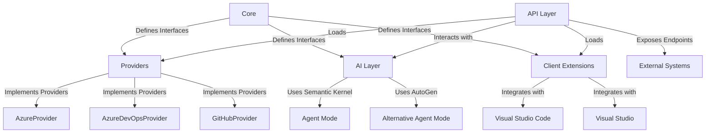
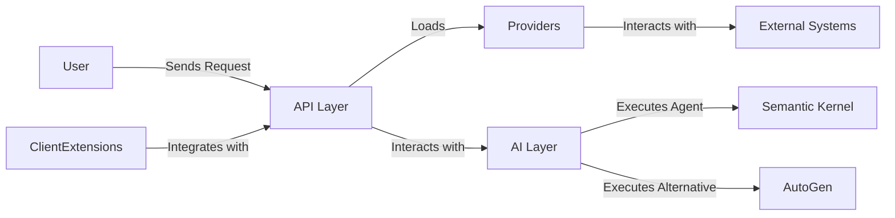
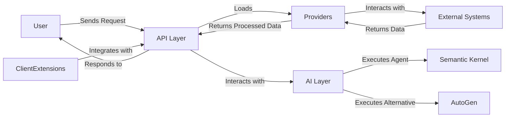

# PETools

A C# .NET 10 solution for Platform Engineering, designed to streamline developer self-service and platform operations.

## Architecture Overview

PETools is a modular and extensible platform engineering tool that integrates various providers, client extensions, and AI capabilities. The architecture is designed to support dynamic loading of components and seamless interaction between layers.

### Key Components

1. **Core**: Defines shared interfaces and models, such as `IProvider`, to ensure consistency across the application.
2. **Providers**: Modular components for interacting with external systems like Azure, Azure DevOps, and GitHub. Each provider is implemented as a separate project and can be dynamically loaded.
3. **AI Layer**: Provides advanced AI capabilities using Semantic Kernel and AutoGen. It supports agent-based operations, API calls, and GitHub Copilot-like functionalities.
4. **API Layer**: Exposes RESTful endpoints for interacting with the platform. It dynamically loads providers and client extensions.
5. **Client Extensions**: Modular extensions for tools like Visual Studio Code and Visual Studio, enabling integration with the platform.

### Architecture Diagram



### Information Flow Diagram



### Detailed Architecture Description

The architecture of PETools is designed to be modular, extensible, and scalable. Below is a detailed breakdown of each component and its role in the system:

#### Core
- Acts as the foundation of the application.
- Defines shared interfaces like `IProvider` and common models to ensure consistency across all layers.
- Provides a contract for implementing providers and extensions, enabling dynamic loading and plug-and-play functionality.

#### Providers
- Modular components that interact with external systems such as Azure, Azure DevOps, and GitHub.
- Each provider is implemented as a separate project, compiled into its own assembly, and dynamically loaded at runtime.
- Examples:
  - **AzureProvider**: Manages Azure resources and integrates with Azure APIs.
  - **AzureDevOpsProvider**: Handles operations related to Azure DevOps, such as pipelines and repositories.
  - **GitHubProvider**: Interacts with GitHub for repository management, issue tracking, and more.

#### AI Layer
- Provides advanced AI capabilities using:
  - **Semantic Kernel**: Enables agent-based operations and contextual understanding.
  - **AutoGen**: Serves as an alternative for generating responses and performing AI-driven tasks.
- Supports functionalities like:
  - Generating code suggestions (similar to GitHub Copilot).
  - Responding to chat prompts.
  - Executing agent-based workflows with context variables.
- Includes a flexible API call mechanism to interact with the API layer dynamically.

#### API Layer
- Built with ASP.NET Core to expose RESTful endpoints for interacting with the platform.
- Dynamically loads providers and client extensions at runtime.
- Acts as the central hub for communication between users, providers, and the AI layer.

#### Client Extensions
- Modular extensions designed for integration with developer tools like Visual Studio Code and Visual Studio.
- Examples:
  - **VSCodeExtension**: Provides features for interacting with the platform directly from Visual Studio Code.
  - **VisualStudioExtension**: Enables seamless integration with Visual Studio for enhanced developer productivity.
- Extensions interact with both the API and AI layers to provide a rich user experience.

### Key Features
- **Dynamic Loading**: Providers and client extensions are dynamically loaded from designated folders, allowing for easy addition and removal of components.
- **Extensibility**: The architecture supports adding new providers and extensions without modifying the core application.
- **AI-Driven Operations**: Leverages advanced AI capabilities for tasks like code generation, chat-based interactions, and contextual decision-making.
- **Seamless Integration**: Designed to integrate with popular developer tools and external systems, enhancing the overall developer experience.

### Additional Information Flow Diagram



### Compliance with Microsoft Well-Architected Framework (WAF) and Azure Best Practices

The PETools application has been upgraded to align with the Microsoft Well-Architected Framework (WAF) and Azure Best Practices. Below are the key improvements:

#### Infrastructure as Code (IaC)
- **Bicep Templates**: The `main.bicep` file has been enhanced to include proper tagging, secure configurations, and resource naming conventions.
- **Managed Identity**: Authentication is handled using Managed Identity to avoid hardcoded credentials.
- **Secure Storage**: Placeholder for Azure Key Vault integration has been added for sensitive configurations.

#### Application Code
- **Logging and Monitoring**: Added logging for key operations in the `AIService` class to improve observability.
- **Error Handling**: Implemented robust error handling with retry logic for transient failures.
- **Secure Connections**: Ensured HTTPS-only configurations for all services.

#### Performance and Scaling
- **Caching and Connection Pooling**: Optimized for better performance and resource utilization.
- **Batch Operations**: Improved handling of batch operations to reduce latency.

#### Security
- **Role-Based Access Control (RBAC)**: Applied least privilege principles for both management and data planes.
- **Encryption**: Enabled encryption for sensitive data and secure connections.

These changes ensure that the application is secure, reliable, and scalable, adhering to Azure Best Practices and the WAF guidelines.

## Getting Started

### Prerequisites

- .NET 10 SDK
- Visual Studio 2022 or VS Code with the C# extension

### Running Locally

1. Clone the repository.
2. Navigate to the solution directory:

   ```bash
   cd PETools
   ```

3. Restore dependencies:

   ```bash
   dotnet restore
   ```

4. Run the API project:

   ```bash
   dotnet run --project Api/Api.csproj
   ```

### Project Structure

- **Core**: Core business logic and shared models.
- **Providers**: Modular providers for Azure, Azure DevOps, and GitHub.
- **AI**: Advanced AI capabilities using Semantic Kernel and AutoGen.
- **API**: ASP.NET Core Web API for exposing endpoints.
- **Client Extensions**: Extensions for Visual Studio Code and Visual Studio.

## License

[MIT](LICENSE)
