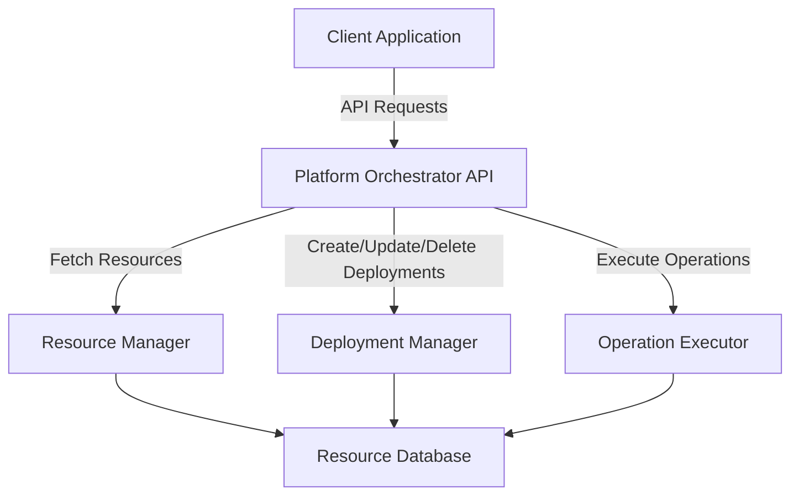

# Platform Orchestrator

The Platform Orchestrator is a powerful tool designed to manage and automate resource deployments and operations across various environments. This document provides instructions on how to use the orchestrator effectively.

## Features

- Health check endpoint to verify service availability.
- Fetch resources with filters and pagination.
- Create, update, and delete deployments.
- Execute operations on resources.

## Getting Started

1. Clone the repository and navigate to the `PlatformOrchestrator.Api` directory.
2. Start the API service by running the following command:
   ```bash
   dotnet run
   ```
3. Use the `.http` file provided in the `PlatformOrchestrator.Api` directory to test the API endpoints.

## API Endpoints

### Health Check
- **GET** `/health`
  - Verifies the service is running.

### Fetch Resources
- **GET** `/api/orchestrator/resources`
  - Query resources with filters like `resourceType`, `region`, `pageSize`, and `pageNumber`.

### Create Deployment
- **POST** `/api/orchestrator/deployments`
  - Create a new resource deployment by providing details like `name`, `resourceType`, `region`, and `parameters`.

### Update Deployment
- **PUT** `/api/orchestrator/deployments/{deploymentId}`
  - Update an existing deployment.

### Delete Deployment
- **DELETE** `/api/orchestrator/deployments/{deploymentId}`
  - Remove a deployment.

### Execute Operations
- **POST** `/api/orchestrator/operations`
  - Perform operations like `start`, `stop`, or `restart` on resources.

## Testing

Use the `.http` file to test the API endpoints. Update the `{{PlatformOrchestrator.Api_HostAddress}}` variable to match your local or deployed API address.

## Contributing

Contributions are welcome! Please follow the guidelines outlined in the `CONTRIBUTING.md` file.

## Architecture

The following diagram illustrates the architecture of the Platform Orchestrator:



### Detailed Architecture Information

The Platform Orchestrator is designed with a modular architecture to ensure scalability, maintainability, and ease of integration. Below is a detailed explanation of each component in the architecture:

1. **Client Application**:
   - This represents the end-user interface or external system that interacts with the Platform Orchestrator API.
   - It sends API requests to perform operations such as resource management, deployment, and monitoring.

2. **Platform Orchestrator API**:
   - Acts as the central entry point for all client requests.
   - Handles authentication, request validation, and routing to the appropriate internal components.

3. **Resource Manager**:
   - Responsible for fetching and managing resource metadata.
   - Interacts with the Resource Database to retrieve and update resource information.

4. **Deployment Manager**:
   - Manages the lifecycle of deployments, including creation, updates, and deletion.
   - Ensures that deployments adhere to predefined policies and configurations.

5. **Operation Executor**:
   - Executes operations on resources, such as starting, stopping, or restarting services.
   - Provides feedback on the success or failure of operations.

6. **Resource Database**:
   - Serves as the central repository for all resource-related data.
   - Stores metadata, deployment configurations, and operation logs.

This architecture ensures that the Platform Orchestrator can handle complex resource management tasks while maintaining high performance and reliability.